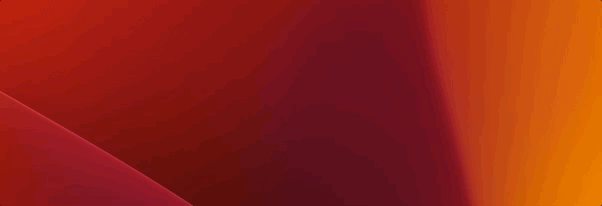
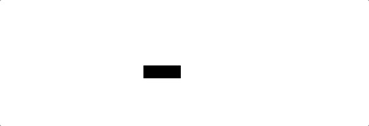
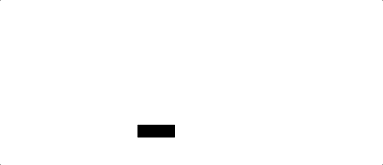
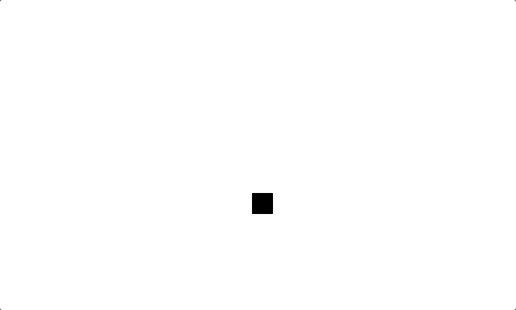
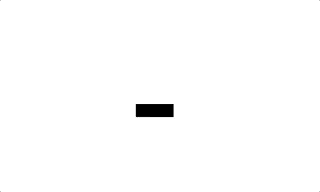

<a name="readme-top"></a>
# Snake Game

<div align="center">
<!-- Title: -->
<h1><a href="https://github.com/skthati/Turtle/">Snake Game</a> - Python Turtle </h1>
</div>

<!-- Table of contents -->
<hr>
<hr>
<ol>
    <li><a href="#basics">Basics</a> </li>
</ol>
<hr>
<hr>

<!-- Test1  -->
## Build Snake <a name="build_snake"></a>
Initial stage of snake.

1. Code
    ```Python
    from turtle import Turtle, Screen

    # t = Turtle()
    sc = Screen()
    # t.shape("square")
    # t.color("blue")
    sc.screensize(600, 600)

    snake = []
    for i in range(3):
        snake.append("A" + str(i))

    x = 0
    y = 0
    for i in range(len(snake)):
        snake[i] = Turtle()
        snake[i].shape("square")
        snake[i].color("black")
        snake[i].goto(x, y)
        x -= 20

    for i in range(10):
        for i in range(len(snake)):
            snake[i].forward(20)

    sc.exitonclick()
    ```

2. Output


<p align="right">(<a href="#readme-top">back to top</a>)</p>
<hr>  

<!-- Test1  -->
## Better Snake <a name="better_snake"></a>
Make a better snake. Using screen tracer, delay and time sleep.

1. Code
    ```Python
    sc.tracer(0)

    for i in range(10):
        sc.update()
        time.sleep(0.5)
        for i in range(len(snake)):
            snake[i].forward(20)
            sc.delay(100)
    ```

2. Output


[Full Code location](snake.py)

<p align="right">(<a href="#readme-top">back to top</a>)</p>
<hr>  

<!-- Test1  -->
## Not working and working snake turn <a name="snake_turn"></a>
The whole code may not be a good idea but it works and got to know how it may behave

1. Code
    ```Python
    for i in range(2):
    sc.update()
    time.sleep(0.5)
    for i in range(len(snake)):
        snake[i].forward(20)
        sc.delay(100)

    for i in range(1):
        # sc.update()
        # time.sleep(1)
        for i in range(len(snake)):
            if i == 0:
                snake[i].left(90)
                # snake[i].forward(20)
            if i == 1:
                snake[i-1].forward(20)
                snake[i].forward(20)
                snake[i].left(90)
                snake[i+1].forward(20)
                # snake[i].forward(20)
            if i == 2:
                snake[i-2].forward(20)
                snake[i-1].forward(20)
                snake[i].forward(20)
                snake[i].left(90)
                # snake[i].forward(20)
            # for j in range(int(i)):
            #     snake[i].forward(20)
            #     snake[i].left(90)
            # sc.delay(100)

    for i in range(5):
        sc.update()
        time.sleep(0.5)
        for i in range(len(snake)):
            snake[i].forward(20)
            sc.delay(100)
    ```

2. Output





[Full Code location](snake.py)

<p align="right">(<a href="#readme-top">back to top</a>)</p>
<hr>  

<!-- Test1  -->
## Working Snake <a name="working_snake"></a>
Working snake with arrow keys to switch directions.

Used classes.

1. Code
    ```Python
    sc.onkey(key="Up", fun=up_move)
    sc.onkey(key="Right", fun=right_move)
    sc.onkey(key="Left", fun=left_move)
    sc.onkey(key="Down", fun=down_move)
    ```

2. Output

    


[main.py file.](main.py)

[snake1.py class file.](snake1.py)

<p align="right">(<a href="#readme-top">back to top</a>)</p>
<hr>  
